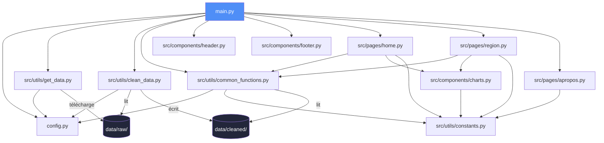

# Projet Data : Marché immobilier français 2024

Dashboard interactif d'analyse du marché immobilier résidentiel français à l'échelle communale, basé sur les données DVF (Demandes de Valeurs Foncières) agrégées pour l'année 2024. Construit avec Python, Dash et Plotly.

## User Guide

### Installation

```bash
git clone https://github.com/YoussefJ04/data_project.git
cd data_project
python -m venv .venv
source .venv/bin/activate         # Linux / macOS
# ou : .venv\Scripts\activate     # Windows
python -m pip install -r requirements.txt
```

### Lancement

```bash
python main.py
```

Puis ouvrir **http://127.0.0.1:8050** dans un navigateur web.

### Vidéo de démonstration

Une démonstration des fonctionnalités et interactions du dashboard est disponible ici : https://youtu.be/VGJpfsw4osk

Au premier lancement, si les données ne sont pas présentes localement, le programme les télécharge automatiquement depuis les sources publiques (cf. section *Data*), les stocke dans `data/raw/`, puis génère le fichier nettoyé dans `data/cleaned/`. Les fichiers étant fournis dans le dépôt, le dashboard est utilisable immédiatement, y compris **sans connexion internet**.

### Utilisation

Le dashboard comporte trois pages accessibles via la barre de navigation :

- **Vue nationale** : indicateurs clés du marché, distribution des prix au m² et carte de toutes les communes. Un menu déroulant permet de filtrer dynamiquement par région.
- **Par région** : analyse détaillée d'une région sélectionnée, avec distribution des prix, comparaison maisons / appartements par département, et carte zoomée.
- **À propos** : contexte du projet, sources et méthodologie.

## Data

### Source principale

[**Indicateurs Immobiliers par commune et par année (2014-2024)**](https://www.data.gouv.fr/datasets/indicateurs-immobiliers-par-commune-et-par-annee-prix-et-volumes-sur-la-periode-2014-2024) — data.gouv.fr

- **Producteur** : Boris Mericskay
- **Licence** : Open Database License (ODbL)
- **Méthodologie détaillée** : [journals.openedition.org/cybergeo/39583](https://journals.openedition.org/cybergeo/39583)
- **Format** : CSV agrégé par commune et par année (le projet utilise le millésime 2024)
- **Variables** : nombre de mutations, ventes de maisons / appartements, prix moyen, prix moyen au m², surface moyenne

### Source géographique

[**API Découpage administratif**](https://geo.api.gouv.fr/) — Etalab (sans clé d'API requise)

Utilisée pour récupérer le centroïde (latitude / longitude), le département, la région et la population de chaque commune française à partir de son code INSEE.

### Pipeline de données

| Étape | Script | Sortie |
|-------|--------|--------|
| Récupération | `src/utils/get_data.py` | `data/raw/indicateurs_dvf_communes_2024.csv` + `data/raw/communes_geo.csv` |
| Nettoyage | `src/utils/clean_data.py` | `data/cleaned/dvf_communes_geo_2024.csv` |

Le nettoyage joint les deux sources sur le code INSEE, écarte les valeurs aberrantes (prix au m² hors bornes 330–15 000 €/m², surfaces hors 10–400 m²) et les communes non géolocalisables. Les URLs des sources et les chemins de fichiers sont centralisés dans `config.py`.

## Developer Guide

### Architecture

Le projet suit un paradigme de **programmation impérative** : les fonctions sont organisées en modules thématiques et appelées depuis le programme principal `main.py`. Les pages et composants du dashboard sont structurés en packages Python.



### Organisation des répertoires

```
data_project/
├── config.py                  # URLs sources, chemins, constantes de nettoyage
├── main.py                    # point d'entrée : pipeline + serveur Dash
├── requirements.txt           # dépendances (construites manuellement)
├── pyproject.toml             # configuration du linter ruff
├── data/
│   ├── raw/                   # données brutes téléchargées
│   └── cleaned/               # données nettoyées prêtes pour le dashboard
├── src/
│   ├── components/            # composants réutilisables (header, footer, graphiques)
│   ├── pages/                 # une page = un module (home, region, apropos)
│   └── utils/                 # récupération, nettoyage, fonctions partagées
```

### Ajouter une nouvelle page

1. Créer `src/pages/ma_page.py` avec une fonction `layout() -> html.Div`.
2. Importer le module dans `main.py` (avec les autres pages).
3. Ajouter une route dans la fonction `display_page()` de `main.py`.
4. Ajouter le lien dans `src/components/header.py`.

### Ajouter un nouveau graphique

1. Écrire une fonction de construction de figure dans `src/components/charts.py`, retournant un objet `go.Figure`.
2. L'appeler dans le `layout()` ou le callback de la page concernée.
3. Si le graphique doit être dynamique, créer un `dcc.Graph` avec un `id` et un callback `@callback` associé.

### Qualité du code

Le code est typé (type hints), documenté (docstrings) et vérifié par le linter `ruff` :

```bash
python -m ruff check .
```

## Rapport d'analyse

L'analyse porte sur **29 830 communes françaises** et **704 181 transactions immobilières** enregistrées en 2024.

### De fortes disparités géographiques

Le prix moyen au m² (pondéré par le nombre de transactions) s'établit à **3 147 €** au niveau national, mais cette moyenne masque des écarts régionaux considérables. L'Île-de-France domine très largement avec **5 603 €/m²**, suivie par Provence-Alpes-Côte d'Azur (**4 212 €/m²**) et la Corse (**3 904 €/m²**). À l'opposé, le Grand Est (**1 739 €/m²**), la Bourgogne-Franche-Comté (**1 791 €/m²**) et le Centre-Val de Loire (**1 895 €/m²**) ferment la marche. L'écart entre la région la plus chère et la moins chère atteint un facteur **3,2**.

L'écart entre prix moyen (3 147 €/m²) et prix médian par commune (1 712 €/m²) confirme que les communes les plus chères, bien que minoritaires, tirent fortement la moyenne vers le haut. Les communes les plus chères se concentrent dans les stations de montagne savoyardes, sur le littoral azuréen et dans les Hauts-de-Seine.

### Une concentration marquée des transactions

Le marché est très inégalement réparti dans l'espace : le **top 10 % des communes concentre 70,8 % des transactions**, et le **top 1 % à lui seul en représente 36,8 %**. Autrement dit, l'essentiel de l'activité immobilière se déroule dans un nombre restreint de communes urbaines, tandis que la majorité du territoire connaît une activité faible.

### Maisons et appartements : des marchés distincts

Sur l'ensemble du pays, les **maisons représentent 56,8 %** des biens vendus, contre 43,2 % pour les appartements. Le prix de vente moyen d'un appartement (**268 382 €**) dépasse celui d'une maison (**210 074 €**), un écart qui s'explique par la concentration des appartements dans les zones urbaines denses où le foncier est plus cher. La répartition maisons / appartements varie fortement selon les régions, comme le montre le graphique comparatif de la page « Par région ».

### Conclusion

Le marché immobilier français de 2024 se caractérise par une **double fracture** : géographique, entre une Île-de-France et un littoral sud très chers et un centre / est du pays nettement plus abordables ; et spatiale, entre quelques pôles urbains très actifs et un vaste territoire à faible volume de transactions.

## Copyright

Nous déclarons sur l'honneur que le code fourni a été produit par nous-mêmes, à l'exception des éléments mentionnés ci-dessous.

### Recours à l'intelligence artificielle

Conformément à l'autorisation de l'enseignant, ce projet a été développé avec l'assistance d'une IA agentique (Claude, Anthropic), utilisée comme outil de génération et de débogage de code sous notre direction. Les prompts les plus structurants ayant orienté la conception sont listés ci-dessous :


1. *« Mettre en place le pipeline de données : un script `get_data.py` qui télécharge les données DVF et les coordonnées des communes depuis des sources publiques reproductibles, et un script `clean_data.py` qui nettoie et joint les deux sources. »*
2. *« Construire un dashboard Dash multi-pages avec une vue nationale, une analyse par région filtrable dynamiquement, et une page À propos. »*
3. *« Déboguer les callbacks Dash qui ne s'affichent pas et corriger l'incohérence des codes région entre le CSV et le menu déroulant. »*
4. *« Améliorer la qualité du code : configuration ruff, typage des fonctions, docstrings, gestion explicite des erreurs réseau. »*
5. *Design du readme*


Le choix du sujet, la structure du projet, la validation des résultats et la rédaction finale relèvent de notre responsabilité. Aucune ligne de code n'a été empruntée à une source tierce (forum, dépôt externe) sans être mentionnée ici.

